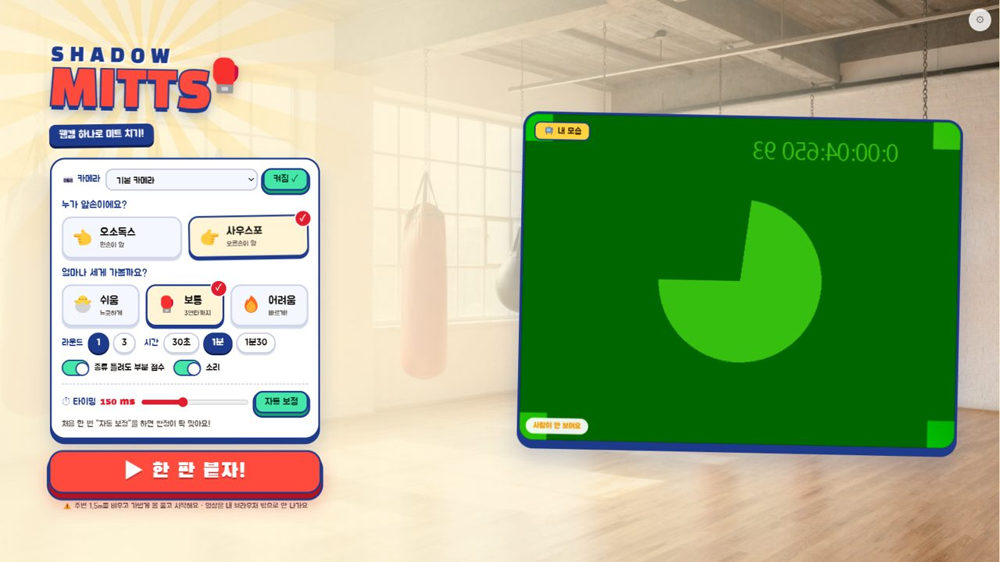
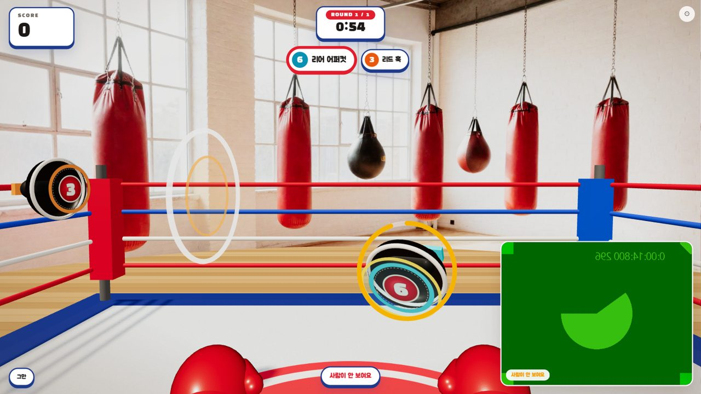
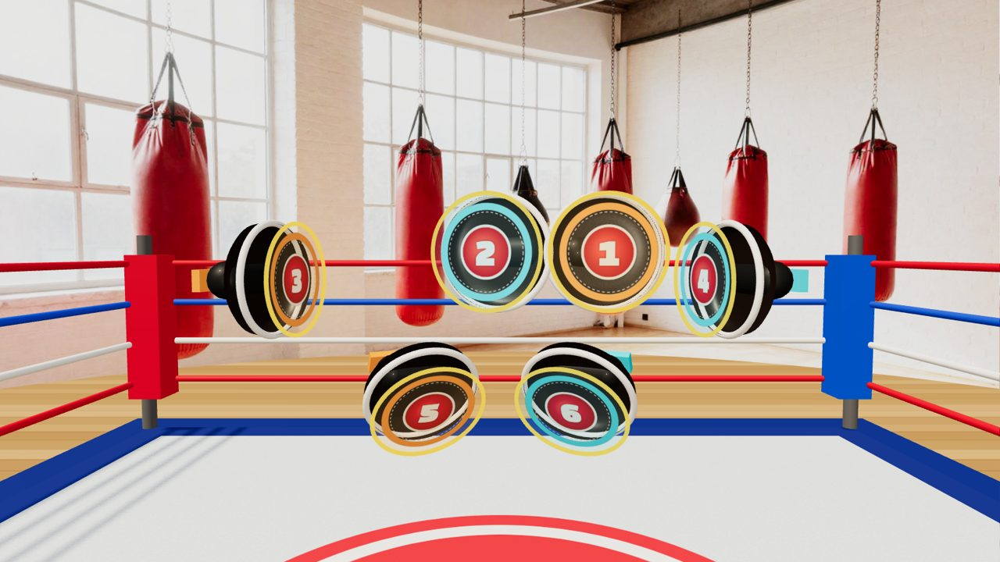
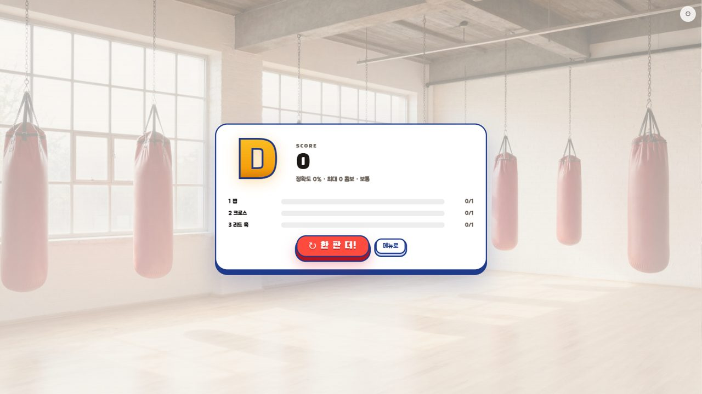

# 🥊 Shadow Mitts

**웹캠 하나로 하는 복싱 미트 트레이닝 게임.**
트레이너가 대 주는 미트를 향해, 번호로 불리는 실제 복싱 콤보(1 잽 · 2 크로스 · 3 리드 훅 …)를 쳐서 맞히는 브라우저 게임입니다.
키보드도, 센서도 없이 **웹캠 영상의 포즈 인식만으로** 어느 손으로 · 어떤 펀치를 · 언제 쳤는지 판정합니다.

> 영상은 브라우저 안에서만 처리되며 어디로도 전송되지 않습니다. 서버가 없는 정적 웹앱입니다.

| 메뉴 | 게임 화면 |
|---|---|
|  |  |
| **펀치별 미트 (사우스포 기준)** | **결과** |
|  |  |

<sub>스크린샷의 초록색 카메라 화면은 자동 테스트용 가상 카메라입니다.</sub>

## 특징

- **실제 복싱 번호 콤보** — 1~6번(잽·크로스·리드/리어 훅·리드/리어 어퍼컷)을 "1-2-3"처럼 출제. 오소독스/사우스포 지원.
- **펀치 종류를 팔 자세로 판단** — 팔뚝 각도·팔꿈치 높이·딥 동작으로 직선/훅/어퍼컷을 구분. 주먹 높이를 맞출 필요가 없음.
- **미트 대 주기 판정** — 미트가 도착해 잠깐 머무는 동안 치면 맞음(도착 무렵은 PERFECT). 한 순간에 맞혀야 하는 리듬게임식이 아님.
- **1인칭 3D 링** — three.js로 모델링한 포커스 미트·글러브·링. 펀치 종류마다 미트가 날아오는 경로와 각도가 달라 한눈에 구분됨.
- **가드 채점** — 치지 않는 손이 턱 근처에 있으면 가드 보너스.
- **지연 자동 보정** — 카메라·인식 지연을 8번의 잽으로 측정해 판정에 반영.
- **카메라 없이 테스트 가능** — 인식 로직은 순수 TypeScript. 합성 데이터 단위 테스트 + 녹화 데이터 재생·채점.

## 빠른 시작

```bash
npm install
npm run dev          # → http://localhost:5173  (Chrome 권장)
```

1. **카메라 켜기** → 1.5~2m 뒤에서 양 어깨~손목이 보이게 서기
2. 스탠스(오소독스/사우스포)와 난이도 선택
3. 처음 한 번 **자동 보정** (링에 맞춰 잽 8번)
4. **▶ 한 판 붙자!**

자세한 사용법은 [docs/USAGE.md](docs/USAGE.md).

> Windows PowerShell에서 `npm` 실행이 막히면 `npm.cmd run dev`를 쓰세요.

## 명령어

| 명령 | 설명 |
|---|---|
| `npm run dev` | 개발 서버 |
| `npm test` | 단위 테스트 (카메라 불필요) |
| `npm run eval` | `recordings/*.json` 녹화로 펀치 인식 채점 (`-v` 이벤트 목록, `--mirror` 좌우 반전 검사) |
| `npm run build` | 정적 빌드 → `dist/` |

## 기술 스택

- **포즈 인식**: MediaPipe Pose Landmarker (`@mediapipe/tasks-vision`, lite 모델, GPU → CPU 폴백)
- **3D**: three.js (절차적 모델링, 그림자, ACES 톤매핑)
- **언어/빌드**: TypeScript, Vite, 프레임워크 없음
- **테스트**: Vitest (Node)
- **사운드**: WebAudio 합성 (오디오 파일 없음)

## 구조 한눈에

```
src/core/   순수 로직 (DOM·카메라 없음, Node에서 테스트)
  features.ts   랜드마크 → 팔 특징 (어깨 중점 기준, 몸통 길이 단위)
  punch.ts      팔별 상태기계로 펀치 검출
  classify.ts   팔 자세로 직선/훅/어퍼컷 분류
  game.ts       출제·판정·점수·콤보·지연 보정
  params.ts     모든 튜닝 임계값 (화면 슬라이더로 노출)
src/app/    브라우저 (카메라, MediaPipe, three.js 장면, UI)
tests/      합성 포즈 단위 테스트 + 녹화 회귀 테스트
```

설계 원칙, 인식 방식의 근거, 테스트·튜닝 방법은 [docs/DEVELOPMENT.md](docs/DEVELOPMENT.md).
최초 기획서는 [DESIGN.md](DESIGN.md).

## 인식 성능 (측정값)

사우스포 1인의 웹캠 녹화 15개(135펀치, 25~58fps)로 측정. 좌우 반전(오소독스)으로 돌려도 같은 결과.

| 지표 | 결과 |
|---|---|
| 가드만 / 몸통 회전만 한 구간의 오검출 | 0 |
| 친 손 + 시점 검출 | 124/135 (92%) |
| 펀치 번호까지 정답 | 119/135 (88%) |
| 추가 검출 (반대손·중복) | 9회 |

**한계** — 한 사람·한 공간·한 카메라로 만든 규칙입니다. 웹캠 1대는 앞뒤 깊이를 거의 못 보므로
카메라 정면으로 뻗는 펀치는 화면상 움직임이 작고, 저프레임(25fps)에서 아주 빠른 연속 잽을 놓칠 수 있습니다.
다른 사람·환경에서는 개발자 도구(⚙)의 슬라이더 조정이 필요할 수 있습니다.

## 로드맵

- [x] M0 관측 도구 (포즈 오버레이, 녹화/재생)
- [x] M1 펀치 검출·분류
- [x] M2 미트 게임 (판정, 점수, 콤보, 가드, 지연 보정, 3D 장면)
- [ ] M3 타격감 (히트 이펙트, 화면 흔들림, 타격음)
- [ ] M4 성장 요소 (약점 적응형 출제, 결과 카드 PNG, 기록)
- [ ] M5 마감 (온보딩, 접근성 옵션, 배포)

## 크레딧

- [MediaPipe](https://developers.google.com/mediapipe) (Apache-2.0), [three.js](https://threejs.org) (MIT)
- 폰트: Black Han Sans, Jua, Noto Sans KR (Google Fonts, OFL)
- 체육관 배경 사진: 이미지 생성 AI(Higgsfield)로 제작
